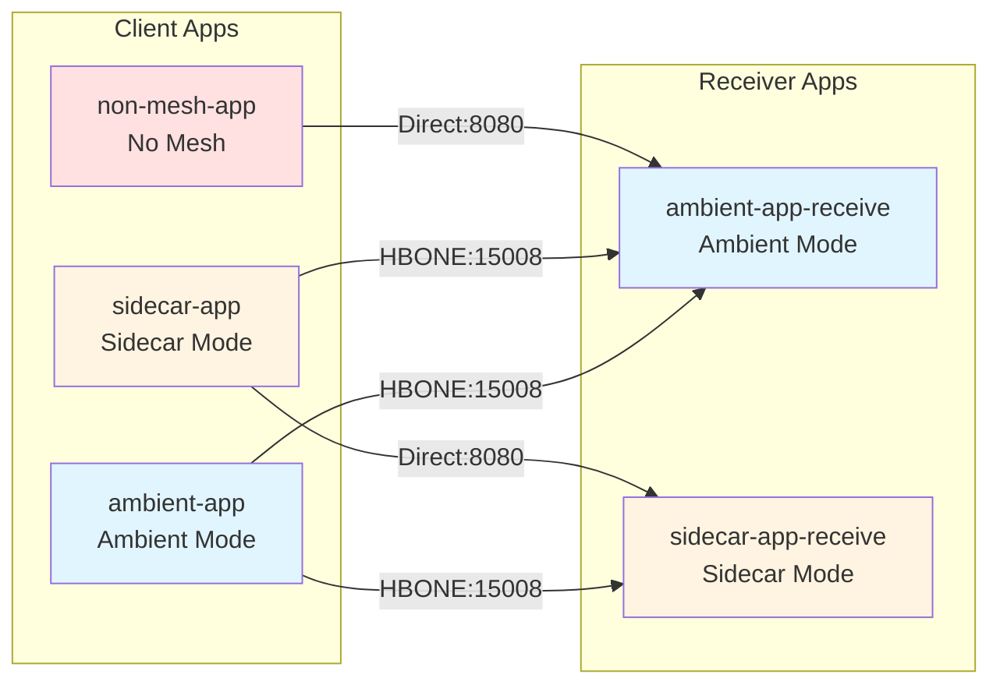

# Istio Ambient Mesh Testing

This project demonstrates network connectivity patterns between different Istio mesh modes (Ambient, Sidecar, and Non-mesh) with network policies.

## Running the Application

```bash
npm run setup
```

## Application Architecture

### Receiver Applications

- **ambient-app-receive**: Ambient mesh mode receiver
- **sidecar-app-receive**: Sidecar proxy mode receiver

### Client Applications

- **ambient-app**: Ambient mesh client (connects to both receivers)
- **sidecar-app**: Sidecar proxy client (connects to both receivers)
- **non-mesh-app**: Non-mesh client (connects to ambient receiver only)

## Network Policy Requirements

All namespaces have common network policies:

- Default deny all (ingress + egress)
- Allow egress to istio-system namespace
- Allow DNS queries to kube-system

### Application-Specific Network Policies

The following table shows the network policies required for inter-app communication based on Istio modes:

| Source App | Source Mode | Target App | Target Mode | Egress Policy (Source) | Ingress Policy (Target) |
|------------|-------------|------------|-------------|------------------------|-------------------------|
| ambient-app | Ambient | ambient-app-receive | Ambient | Port 15008 (HBONE) | Port 15008 (HBONE) |
| ambient-app | Ambient | sidecar-app-receive | Sidecar | Port 15008 (HBONE) | Port 15008 (HBONE) |
| sidecar-app | Sidecar | ambient-app-receive | Ambient | Port 15008 (HBONE) | Port 15008 (HBONE) |
| sidecar-app | Sidecar | sidecar-app-receive | Sidecar | Port 8080 (Direct) | Port 8080 (Direct) |
| non-mesh-app | None | ambient-app-receive | Ambient | Port 8080 (Direct) | Port 8080 (Direct) |

### Key Insights

**HBONE (HTTP-Based Overlay Network Encapsulation) - Port 15008:**

- Used when **any ambient mesh pod** is involved in communication
- Provides L7 security features through the ztunnel component

**Direct Communication - Port 8080:**

- **Sidecar-to-Sidecar**: Direct Envoy proxy communication on application port
- **Non-mesh-to-Any**: Direct connection without mesh features

## Network Policy Logic

The deployment automatically configures network policies based on source and target Istio modes:

1. **If ambient mesh is involved** (source OR target is ambient): Use HBONE port 15008
2. **If sidecar-to-sidecar**: Use direct port 8080 (Envoy-to-Envoy)
3. **If non-mesh is involved**: Use direct port 8080

This ensures proper L4/L7 security while maintaining connectivity across different mesh modes.

## Architecture Diagram


