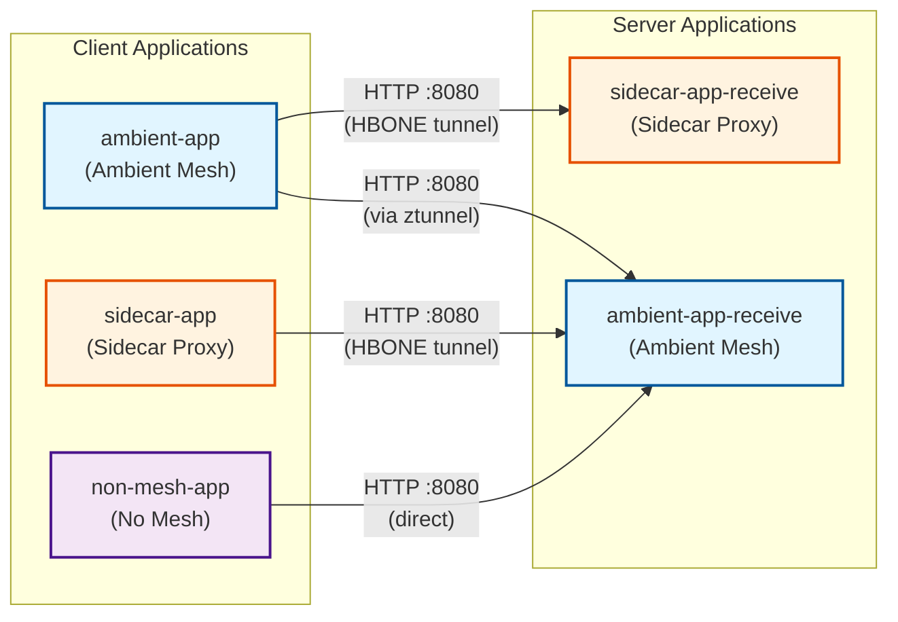

# Istio Ambient to Sidecar Testing

This project tests network connectivity and minimum required network policies between different Istio deployment modes: ambient mesh, sidecar proxy, and non-mesh applications.

## Overview

The test setup verifies the minimum network policy requirements (assuming a default deny network policy) to allow traffic between:
- Ambient mesh applications
- Sidecar-injected applications
- Non-mesh applications (baseline for comparison)

The environment demonstrates four distinct traffic patterns across five namespaces, validating mesh-to-mesh, mesh-to-sidecar, sidecar-to-mesh, and non-mesh-to-mesh communication.

## Quick Start

To deploy the entire test environment:

```bash
./setup.sh
```

This will automatically create the cluster and deploy all test applications.

## Manual Setup

### 1. Create Base Cluster

```bash
./cluster.sh
```

Creates a Kubernetes cluster with Istio installed.

### 2. Deploy Server Applications

Deploy the server applications that will receive traffic:

```bash
./sidecar-app-receive.sh
./ambient-app-receive.sh
```

### 3. Deploy Client Applications

Deploy the client applications that will send traffic:

```bash
./sidecar-app.sh
./ambient-app.sh
./non-mesh-app.sh
```

## Architecture

The setup includes five namespaces demonstrating different Istio deployment modes and their interactions:

**Server Applications (receive traffic):**
- **sidecar-app-receive**: Server application with sidecar proxy injection
- **ambient-app-receive**: Server application in ambient mesh mode

**Client Applications (send traffic):**
- **ambient-app**: Client application in ambient mesh mode
- **sidecar-app**: Client application with sidecar proxy injection
- **non-mesh-app**: Client application outside the service mesh (no sidecar, no ambient)

### Traffic Flow

The test environment validates four distinct traffic patterns:

1. **Ambient → Sidecar**: ambient-app polls sidecar-app-receive (mesh traffic via HBONE tunneling)
2. **Ambient → Ambient**: ambient-app polls ambient-app-receive (mesh traffic via ztunnel)
3. **Sidecar → Ambient**: sidecar-app polls ambient-app-receive (mesh traffic via HBONE tunneling)
4. **Non-mesh → Ambient**: non-mesh-app polls ambient-app-receive (direct traffic on port 8080)



## Namespaces and Deployments

| Namespace | Type | Role | Description |
|-----------|------|------|-------------|
| `sidecar-app-receive` | Sidecar Proxy | Server | HTTP echo server with sidecar injection |
| `ambient-app-receive` | Ambient Mesh | Server | HTTP echo server in ambient mesh |
| `ambient-app` | Ambient Mesh | Client | Polls sidecar-app-receive and ambient-app-receive |
| `sidecar-app` | Sidecar Proxy | Client | Polls ambient-app-receive |
| `non-mesh-app` | No Mesh | Client | Polls ambient-app-receive (direct traffic) |

## Monitoring

### Real-time Status Dashboard

Use the monitoring script to see all connections at a glance with color-coded status:

```bash
# Auto-refresh every second (recommended)
watch -n 1 -c ./monitor.sh

# Or run once for a snapshot
./monitor.sh
```

This displays:
- Green ✓ = Connection successful
- Red ✗ = Connection failed
- Yellow ? = Status unknown
- Pod status for all applications

### Individual Application Logs

Monitor the client applications individually:

```bash
# Ambient client (polls sidecar-app-receive and ambient-app-receive)
kubectl logs -f deployment/ambient-app -n ambient-app

# Sidecar client (polls ambient-app-receive)
kubectl logs -f deployment/sidecar-app -n sidecar-app

# Non-mesh client (polls ambient-app-receive)
kubectl logs -f deployment/non-mesh-app -n non-mesh-app
```

Check network policies:
```bash
kubectl get networkpolicies -n ambient-app-receive
kubectl get networkpolicies -n sidecar-app-receive
```

Test connectivity manually:
```bash
kubectl exec -it deployment/ambient-app -n ambient-app -- curl http://sidecar-service-receive.sidecar-app-receive.svc.cluster.local:8080
kubectl exec -it deployment/ambient-app -n ambient-app -- curl http://ambient-service-receive.ambient-app-receive.svc.cluster.local:8080
kubectl exec -it deployment/sidecar-app -n sidecar-app -- curl http://ambient-service-receive.ambient-app-receive.svc.cluster.local:8080
kubectl exec -it deployment/non-mesh-app -n non-mesh-app -- curl http://ambient-service-receive.ambient-app-receive.svc.cluster.local:8080
```

## Testing Objectives

- Verify cross-namespace communication between ambient and sidecar modes
- Identify minimum NetworkPolicy requirements for ambient-to-sidecar traffic
- Validate Istio configuration for mixed deployment models
- Test all combinations of mesh modes (ambient, sidecar, non-mesh)
