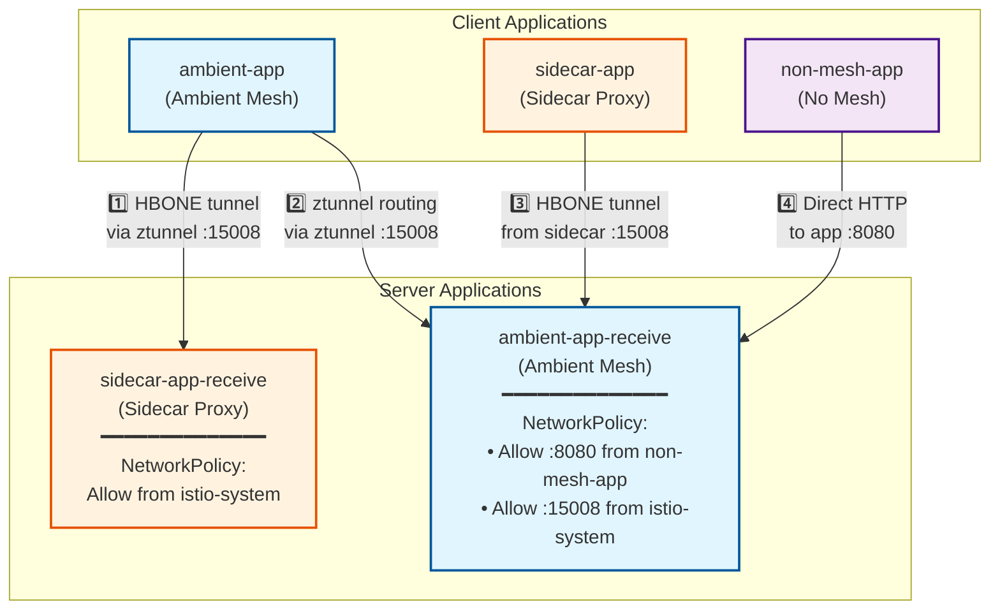

# Istio Ambient to Sidecar Testing

This project demonstrates network connectivity between different Istio deployment modes with the minimum required network policies.

## Quick Start

**1. Deploy the test environment:**

```bash
./setup.sh
```

This creates a Kubernetes cluster with Istio and deploys all test applications.

**2. Monitor the traffic flows:**

```bash
watch -n 1 -c ./monitor.sh
```

This shows real-time status of all connections:

- Green ✓ = Connection successful
- Red ✗ = Connection failed
- Yellow ? = Status unknown

## Architecture

The setup includes five namespaces demonstrating different Istio deployment modes and their interactions:

**Server Applications (receive traffic):**
- **sidecar-app-receive**: Server application with sidecar proxy injection
- **ambient-app-receive**: Server application in ambient mesh mode

**Client Applications (send traffic):**
- **ambient-app**: Client application in ambient mesh mode
- **sidecar-app**: Client application with sidecar proxy injection
- **non-mesh-app**: Client application outside the service mesh (no sidecar, no ambient)

### Traffic Flow and Network Policies

The test environment validates four distinct traffic patterns with specific network policies:



**Network Policy Requirements:**

1. **Ambient → Sidecar**: Requires policy to allow traffic from `istio-system` namespace (ztunnel) on HBONE port 15008
2. **Ambient → Ambient**: Requires policy to allow traffic from `istio-system` namespace (ztunnel) on HBONE port 15008
3. **Sidecar → Ambient**: Requires policy to allow traffic from `istio-system` namespace (ztunnel) on HBONE port 15008
4. **Non-mesh → Ambient**: Requires policy to allow direct traffic from `non-mesh-app` namespace on application port 8080

## What Gets Deployed

| Namespace | Type | Role | Description |
|-----------|------|------|-------------|
| `sidecar-app-receive` | Sidecar Proxy | Server | HTTP echo server with sidecar injection |
| `ambient-app-receive` | Ambient Mesh | Server | HTTP echo server in ambient mesh |
| `ambient-app` | Ambient Mesh | Client | Polls both server applications |
| `sidecar-app` | Sidecar Proxy | Client | Polls ambient-app-receive |
| `non-mesh-app` | No Mesh | Client | Polls ambient-app-receive |

## Troubleshooting

View network policies:

```bash
kubectl get networkpolicies -n ambient-app-receive
kubectl get networkpolicies -n sidecar-app-receive
```

Test connectivity manually:

```bash
kubectl exec -it deployment/ambient-app -n ambient-app -- curl http://sidecar-service-receive.sidecar-app-receive.svc.cluster.local:8080
```
